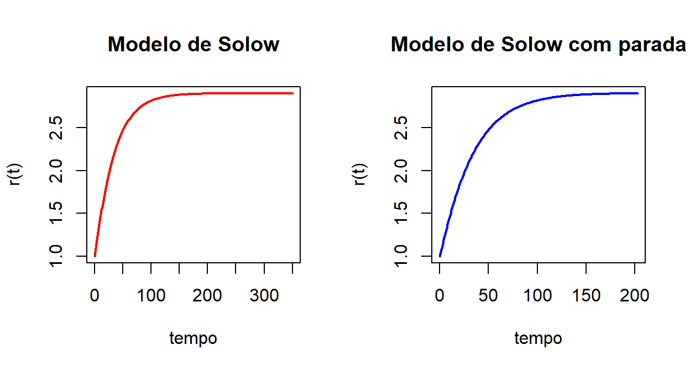
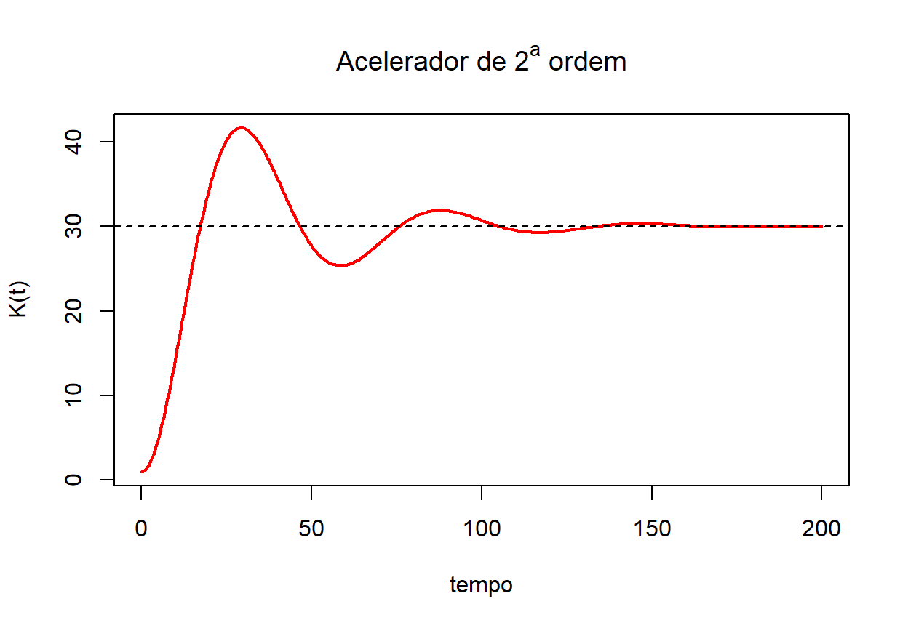

# ODEs


## Introdução

O objetivo geral desta nota é realizar simulações numéricas de equações diferenciais ordinárias com ênfase, especialmente, em aplicações econômicas. Todas as simulações são feitas utilizando-se o software **R** [@WickhamRStudio2014].

Para as simulações, serão utilizados os pacotes abaixo, adicionais à base do **R**. É preciso que sejam instalados (uma única vez) e carregados antes do uso:


```r
## install.packages("deSolve")
## install.packages("PhaseR")
## install.packages("scatterplot3d")
## install.packages("latex2exp")


library(deSolve)       ## Funções para resolver EDOs
library(phaseR)        ## Funções para elaboração dos retratos de fase
library(scatterplot3d) ## Gráficos em 3 dimensões
library(latex2exp)     ## Expressões escritas padrão LaTeX

options(scipen = 99)   ## Utiliza 99 casas decimais como padrão em vez de notação científica
```


Denota-se por equação diferencial ordinária (EDO) uma função desconhecida e a relação com suas derivadas. Como, em economia, costuma-se usar o tempo como variável independente, esta notação permanecerá ao longo do texto se não estiver disposto de outra maneira. Portanto, pode-se representar uma EDO de ordem $n$ por

\begin{equation}
 f[y(t),y^{(1)}(t),y^{(2)}(t),...,y^{(n)}(t),t ] = 0
 (\#eq:edo)
\end{equation} 

em que $(n)$ é o grau da EDO e representa a maior ordem das derivadas da função desconhecida @Seco2018. Uma notação da forma geral pode ser descrita por:

\begin{equation}
a_n(t)y^{(n)}(t)+\dots+a_2(t)y^{(2)}(t)+a_1(t)y^{(1)}(t)+a_0(t)y(t) = g(t) 
(\#eq:geral)
\end{equation}


Neste texto, não serão abordados detalhes teóricos sobre equações diferenciais e sobre os modelos apresentados. O(a) leitor(a) deve recorrer aos documentos citados em caso de interesse.

### EDOs de 1^a^ ordem {#solow}

EDOs de 1^a^ ordem envolvem uma equação em termos da sua primeira derivada $y'(t)$. Conforme @Gandolfo2005, pode-se encontrar uma solução de uma equação homogênea no formato $y(t) = Ae^{-bt}$, cuja estabilidade depende do sinal de $-b$. Alguns exemplos de equações na Figura \@ref(fig:exemplos). 

Apesar de servir de motivação para a análise de EDOs, o objetivo desta nota não é resolver EDOs, encontrando uma função $y(t)$ que a satisfaz, mas sim identificar o comportamento de tais equações a partir de resoluções numéricas e representações gráficas. Portanto, passa-se aos detalhes básicos para as simulações.

<div class="figure">

<p class="caption">(\#fig:exemplos)Elaboração própria.</p>
</div>


### Estrutura básica para simulação com R

Algumas equações diferenciais apresentam soluções analíticas, que podem ser resolvidas a partir de técnicas específicas. Para a economia, uma boa referência é o livro do @Gandolfo2005. Para aplicações mais detalhadas, consultar @Seco2018. Nesses casos, simples técnicas de elaboração de gráficos podem ser adotadas no **R** ou outro software. 

Porém, há situações que não se deseja ou não é simples encontrar uma solução analítica. Para esses casos, o **R** possui pacotes que ajudam a encontrar e representar graficamente soluções numéricas e retratos de fase, que podem ajudar na interpretação dos modelos.

O pacote utilizado para simulação e resolução de EDOs com o **R** é o **deSolve**. Um espectro maior de aplicações e parte das explicações aqui apresentadas podem ser encontradas em @Soetaert2010. Recursos adicionais e manuais podem ser acessados digitando **?deSolve** diretamente no console^[ Alguns exemplos de representação gráfica podem ser vistos com a função *example(deSolve)*.]. 

Em primeiro lugar, deve-se definir uma função própria do modelo a ser simulado em linguagem própria do **R** com, no mínimo, os seguintes parâmetros nesta ordem: 

1. **Tempo** para simulação;
2. Valor **inicial** das variáveis (estado); e
3. **Parâmetros** do modelo.

Quando da resolução, o modelo chamará essa função em cada período de tempo durante o processo de integração. **Tempo** e **valores iniciais** devem ser disponibilizados no formato de vetores (ou listas). A função **with( )**^[ Para ver exemplos da função, clique [aqui](https://statisticsglobe.com/r-with-within-function-example#:~:text=Definition%20of%20with%20%26%20within%3A,AND%20modifies%20the%20original%20data.).] permite usar as variáveis em formato de lista diretamente dentro da função sem que seja necessário indicar o nome da lista todas as vezes. Por fim, a função deve retornar uma lista (os resultados serão concatenados se estivermos interessados em mais de uma EDO). Os comandos estão detalhados abaixo.

Com a função elaborada, são estabelecidos os nomes e valores dos parâmetros, a(s) condição(ões) inicial(is) e o período de tempo que se deseja fazer a simulação. Lembre-se de que, quanto maior o tempo e complexidade do modelo, maior será o nível de exigência computacional^[O tempo demandado para a análise pode ser medido com as seguintes funções concatenadas: **print(system.time(\<código da função ode\>))**.].

Como exemplo de EDO de 1^a^ ordem, pode-se simular o seguinte modelo, baseado no modelo canônico de @Solow1956^[Os detalhes do modelo podem ser consultados, pelo leitor, no artigo original e os artigos que o discutiram posteriormente.] representado na equação \@ref(eq:solow).
\begin{equation}
  \dot{r} = sF(r,1) - nr
  (\#eq:solow)
\end{equation} em que $r = \frac{K}{L}$ é a razão capital-trabalho, $s$ é a taxa de poupança, $n$ é a taxa de crescimento da força de trabalho e $F(r,1)$ é uma função de produção homogênea de grau um a ser especificada. 

No presente caso, uma função Cobb-Douglas na forma $F(K,L) = K^\alpha L^{1-\alpha} \Rightarrow F(r,1) = r^\alpha$ pode ser adotada para a resolução numérica. Portanto, a equação diferencial a ser simulada é:
\begin{equation}
  \dot{r} = sr^\alpha - nr
  (\#eq:solow-cobb)
\end{equation} cuja função para simuação da EDO pode ser construída por:


```r
  #### Função em R que representa a EDO
  solow_edo <- function(tempo, inicial, parametros){  ## Parâmetros da função
  
  list <- as.list(c(inicial, parametros))           ## Lista c/ informações da EDO
  
  with(list, {                                      ## with() acessa elementos da lista
    
    dr = s*r^alpha - n*r                            ## EDO de interesse
    
    list(dr)                                        ## Retorna valores simulados
  })                                                ## Fim do with
}                                                   ## Fim da função
```

A partir da função *solow_edo* criada, pode-se disponibilizar os dados específicos a partir da simulação com a função **ode( )**. Os valores dos parâmetros foram $s = 0.1$, $\alpha = 0.35$ e $n = 0.05$ e o valor inicial $r_0 = 1$. Ao final, estão os três primeiros e últimos resultados:


```r
  
  #### Valor inicial 
r <- c(r = 1)                     ## Formato de vetor nominado de acordo com a função

  #### Parâmetros da função (podem ser estimados)

parametros <- c(s = 0.1,
                alpha = 0.35,
                n = 0.05)         ## Formato de vetor

  #### Sequência de tempo
tempo <- seq(0, 350, by = 1)      

  #### Simulação do modelo  
solow <- ode(y = r,               ## Condição inicial
             times = tempo,       ## Tempo a ser simulado
             func = solow_edo,    ## Função criada
             parms = parametros)  ## Se parâmetros já definidos, use parms = NULL

  #### Exibição dos resultados
head(solow, n=3)                  ## Exibe três primeiros
#>      time        r
#> [1,]    0 1.000000
#> [2,]    1 1.049617
#> [3,]    2 1.098443
tail(solow, n=3)                  ## Exibe três últimos
#>        time        r
#> [349,]  348 2.904818
#> [350,]  349 2.904819
#> [351,]  350 2.904820
```
O gráfico resultado do modelo está descrito na Figura \@ref(fig:solow), sob o título "Modelo de Solow".

### Interrupção automática da simulação

Caso o interesse seja só a fase inicial de uma equação ou se tenha uma EDO convergente, é possível usar a funcionalidade *root* da função **lsodar**^[Esta é a operação padrão na própria função **ode()**.]. 

A simulação será interrompida no momento em que as variáveis de estado estiverem a uma distância entre si menor que um parâmetro pré-definido (no exemplo, uma variação da ordem de 10^-4^). Assim, a função raiz calcula, em primeiro lugar, a taxa de variação e, depois, a diferença entre a soma dos valores absolutos e a tolerância definida:


```r
  #### Critério de parada
raiz <- function(tempo,incial,parametros) {
  
        variacao <- unlist(solow_edo(tempo,incial,parametros)) ## Desfaz lista
        
        sum(abs(variacao)) - 1e-4       ## Tolerância
      }

  #### Nova simulação do modelo, acrescida da raiz
solow_raiz <- lsodar(y = r,
                     times = tempo,
                     func = solow_edo,
                     parms = parametros,
                     rootfun = raiz)    ## Indicação da função criada

tail(solow_raiz, n=3)                   ## Compare com os três últimos sem parada
#>            time        r
#> [202,] 201.0000 2.901594
#> [203,] 202.0000 2.901698
#> [204,] 202.6914 2.901768
```

Por fim, os gráficos estão na Figura \@ref(fig:solow). Note que a função **matplot()**^[Esta função desenha mais de uma coluna de uma matriz ao mesmo tempo. Com a função **plot()**, seriam necessários dois comandos.] foi usada para ter uma interface melhor adaptada à plotagem lado a lado e a lidar com mais de uma variável no mesmo gráfico. Nesta nota, serão dados exemplos também com a função **plot()**, da base do R.

```r
par(mfrow=c(1,2))     ## Define gráficos a seguir em 1 linha e 2 colunas

  #### Série original
matplot(x = solow[,1],
        y = solow[,2],
        type = "l",               ## Gráfico de linha
        lwd = 2,                  ## Largura da linha
        col = "red",
        main = "Modelo de Solow",
        xlab = "tempo",
        ylab = "r(t)")

  #### Série com interrupção
matplot(x = solow_raiz[,1], 
        y = solow_raiz[,2],
        type = "l",
        lwd = 2,
        col = "blue",
        main = "Modelo de Solow com parada",
        xlab = "tempo",
        ylab = "r(t)")
```

<div class="figure">

<p class="caption">(\#fig:solow)Elaboração própria.</p>
</div>

\bigskip
\bigskip

## EDOs de 2^a^ ordem {#edo2}

EDOs de 2^a^ ordem envolvem a segunda derivada da função principal. Vale notar que, para fins computacionais, EDOs de 2^a^ ordem precisam ser escritas sob a forma de um sistema de equações de EDOs de 1^a^ ordem^[Para mais detalhes, ver @Soetaert2012.], bem como duas condições iniciais. Assim, uma EDO no formato
\begin{equation}
\begin{split}
 y'' & = f(y,y',t) \\
 y(t_0) & = y_{0}\\
 y'(t_0) & = y'_{0}
\end{split}
 (\#eq:transformacao1)
\end{equation} pode ser reescrita como
\begin{equation}
\begin{split}
 y' & = y_1 \\
 y'' & = y'_{1} = f(y,y_1,t) \\
 y(t_0) & = y_{0}\\
 y_1(t_0) & = y'_{0}
\end{split}
(\#eq:transformacao)
\end{equation}

A título de exemplo, pode-se simular o modelo de acelerador de segunda ordem exposto em @Gandolfo2005. A EDO do modelo é
\begin{equation}
  K'' + \beta K'+ \alpha \beta K  = \alpha \beta K^*
  (\#eq:acelerador1)
\end{equation} em que $K$ é o estoque corrente de capital, $K^*$ é o estoque desejado de capital, $\beta$ denota a velocidade de ajuste do investimento real ao investimento desejado. Por fim, $\alpha$ é a velocidade de ajuste entre o estoque real e o desejado. 

É possível ampliar o sistema com $K^* = kY$, em que $k$ é a relação capital-produto e $Y$ é o produto da economia. Assim, a equação \@ref(eq:acelerador1) pode ser reescrita, após manipulações algébricas, como
\begin{equation}
  K'' + \beta \left(1-\frac{\alpha k}{1 - b}\right) K'+ \alpha \beta K  = \alpha \beta k\frac{a}{1 - b}
  (\#eq:acelerador2)
\end{equation} em que os termos $a$ e $b$ se referem a uma versão macroeconômica simples de uma função de consumo no formato $C = a + bY$.

A versão em sistema de EDOs de 1^a^ ordem da equação \@ref(eq:acelerador2) pode ser feita considerando $I = K'$ o investimento e isolando as derivadas no lado esquerdo das equações:
\begin{equation}
\begin{split}
 K' & = I \\
 I' & =  -\beta \left(1-\frac{\alpha k}{1 - b}\right) I - \alpha \beta K + \alpha \beta k\frac{a}{1 - b}\\
 K(t_0) & = K_{0}\\
 K'(t_0) & = I'(t_0) = I_{0}
\end{split}
(\#eq:acelerador-sistema)
\end{equation}

Diante disso, segue-se passos semelhantes à resolução de EDOs de 1^a^ ordem. Em primeiro lugar, cria-se a função, agora com duas equações e duas saídas de dados.


```r
  #### EDO do Acelerador de 2a ordem
acel_edo <-     function(tempo, inicial, parametros){
      with(as.list(c(inicial, parametros)),{
        
        ## Equações apresentadas em (9)
        dK <- I
        dI <- -beta*(1-(alfa*k/(1-b)))*I - alfa*beta*K + alfa*beta*k*a/(1-b)
        
        list(c(dK,dI))   ## Retorna dois valores
      })
    }
```
Em seguida, definem-se os parâmetros e o gráfico para representá-los na Figura \@ref(fig:acelerador).


```r

tempo <- seq(0,200, by = 0.5)

inicial <- c(K = 1, I = 0)

parametros <- c(alfa = 0.05,
                beta = 0.25,
                a = 2,
                b = 0.8,
                k = 3)

  #### Função semelhante à situação de 1a ordem
acel <- ode(y = inicial,
            times = tempo,
            func = acel_edo,
            parms = parametros)

  #### Gráfico da EDO
plot(x = acel[,"time"],
     y = acel[,"K"],
     type = "l",
     lwd = 2,
     col = "red",
     xlab = "tempo",
     ylab = "K(t)",
     main = TeX("Acelerador de 2^a ordem")) ## Formato de texto LaTeX

abline(h = 30,           ## Acrescenta linha tracejada para o equilíbrio
       lty = "dashed")   
```

<div class="figure">

<p class="caption">(\#fig:acelerador)Elaboração própria.</p>
</div>

Por fim, note que as EDOs de ordem superiores podem ser resolvidas adotando uma combinação dos procedimentos explicitados acima.


