Simulação Numérica de Equações Diferenciais Ordinárias: um guia para uso
do R
================
Rafael de Acypreste[1]Theo Antunes[2]Izabel Flores[3]
11/01/2022


-   [Introdução](#introdução)
-   [EDOs de 1<sup>a</sup> ordem](#solow)
    -   [Estrutura básica para simulação com
        R](#estrutura-básica-para-simulação-com-r)
    -   [Interrupção automática da
        simulação](#interrupção-automática-da-simulação)
-   [EDOs de 2<sup>a</sup> ordem](#edo2)
    -   [Equação com coeficientes
        constantes](#equação-com-coeficientes-constantes)
    -   [Equação de Laguerre](#equação-de-laguerre)
    -   [Equação de Euler](#equação-de-euler)
-   [Equações diferenciais simultâneas](#simultaneas)
-   [Análise de estabilidade](#análise-de-estabilidade)
    -   [Estabilidade de EDO de 1<sup>a</sup>
        ordem](#estabilidade-de-edo-de-1a-ordem)
        -   [Retrato de fase](#retrato-de-fase)
    -   [Estabilidade de sistema de duas EDOs de 1<sup>a</sup> ordem -
        equilíbrio
        dinâmico](#estabilidade-de-sistema-de-duas-edos-de-1a-ordem---equilíbrio-dinâmico)
    -   [Estabilidade de sistema de duas EDOs de 1<sup>a</sup> ordem -
        ponto de
        sela](#estabilidade-de-sistema-de-duas-edos-de-1a-ordem---ponto-de-sela)
-   [Referências](#referências)

# Introdução

O objetivo geral desta nota é realizar simulações numéricas de equações
diferenciais ordinárias com ênfase, especialmente, em aplicações
econômicas. Todas as simulações são feitas utilizando-se o software
**R**.

Para as simulações, serão utilizados os pacotes abaixo, adicionais à
base do **R**. É preciso que sejam instalados (uma única vez) e
carregados antes do uso:

``` r
# install.packages("deSolve")
# install.packages("PhaseR")
# install.packages("scatterplot3d")
# install.packages("latex2exp")


library(deSolve)       # Funções para resolver EDOs
library(phaseR)        # Funções para elaboração dos retratos de fase
library(scatterplot3d) # Gráficos em 3 dimensões
library(latex2exp)     # Expressões escritas padrão LaTeX

options(scipen = 99)   # Utiliza 99 casas decimais como padrão em vez de notação científica
```

Denota-se por equação diferencial ordinária (EDO) uma função
desconhecida e a relação com suas derivadas. Como, em economia,
costuma-se usar o tempo como variável independente, esta notação
permanecerá ao longo do texto se não estiver disposto de outra maneira.
Portanto, pode-se representar uma EDO de ordem *n* por

em que (*n*) é o grau da EDO e representa a maior ordem das derivadas da
função desconhecida [Seco and Patrão](#ref-Seco2018)
([2018](#ref-Seco2018)). Uma notação da forma geral pode ser descrita
por:

Neste texto, não serão abordados detalhes teóricos sobre equações
diferenciais e sobre os modelos apresentados. O(a) leitor(a) deve
recorrer aos documentos citados em caso de interesse.

# EDOs de 1<sup>a</sup> ordem

EDOs de 1<sup>a</sup> ordem envolvem uma equação em termos da sua
primeira derivada *y*′(*t*). Conforme [Gandolfo](#ref-Gandolfo2005)
([2005](#ref-Gandolfo2005)), pode-se encontrar uma solução de uma
equação homogênea no formato *y*(*t*) = *A**e*<sup> − *b**t*</sup>, cuja
estabilidade depende do sinal de  − *b*. Alguns exemplos de equações na
Figura @ref(fig:exemplos).

Apesar de servir de motivação para a análise de EDOs, o objetivo desta
nota não é resolver EDOs, encontrando uma função *y*(*t*) que a
satisfaz, mas sim identificar o comportamento de tais equações a partir
de resoluções numéricas e representações gráficas. Portanto, passa-se
aos detalhes básicos para as simulações.

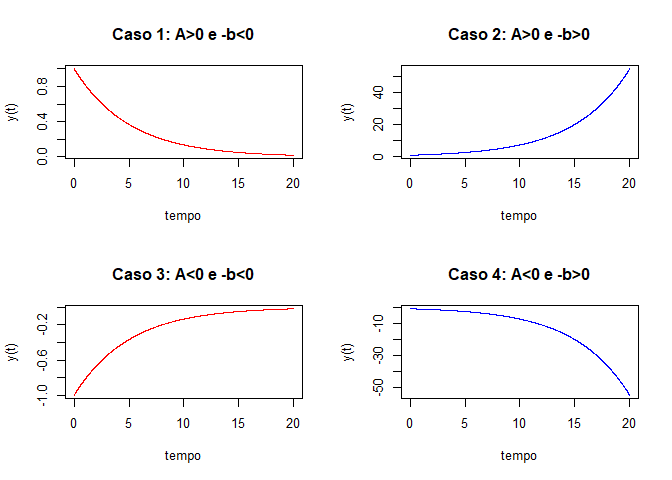

## Estrutura básica para simulação com R

Algumas equações diferenciais apresentam soluções analíticas, que podem
ser resolvidas a partir de técnicas específicas. Para a economia, uma
boa referência é o livro do [Gandolfo](#ref-Gandolfo2005)
([2005](#ref-Gandolfo2005)). Para aplicações mais detalhadas, consultar
[Seco and Patrão](#ref-Seco2018) ([2018](#ref-Seco2018)). Nesses casos,
simples técnicas de elaboração de gráficos podem ser adotadas no **R**
ou outro software.

Porém, há situações que não se deseja ou não é simples encontrar uma
solução analítica. Para esses casos, o **R** possui pacotes que ajudam a
encontrar e representar graficamente soluções numéricas e retratos de
fase, que podem ajudar na interpretação dos modelos.

O pacote utilizado para simulação e resolução de EDOs com o **R** é o
**deSolve**. Um espectro maior de aplicações e parte das explicações
aqui apresentadas podem ser encontradas em [Soetaert, Petzoldt, and
Setzer](#ref-Soetaert2010) ([2010](#ref-Soetaert2010))}. Recursos
adicionais e manuais podem ser acessados digitando **?deSolve**
diretamente no console[4].

Em primeiro lugar, deve-se definir uma função própria do modelo a ser
simulado em linguagem própria do **R** com, no mínimo, os seguintes
parâmetros nesta ordem:

1.  **Tempo** para simulação;
2.  Valor **inicial** das variáveis (estado); e
3.  **Parâmetros** do modelo.

Quando da resolução, o modelo chamará essa função em cada período de
tempo durante o processo de integração. **Tempo** e **valores iniciais**
devem ser disponibilizados no formato de vetores (ou listas). A função
**with( )**[5] permite usar as variáveis em formato de lista diretamente
dentro da função sem que seja necessário indicar o nome da lista todas
as vezes. Por fim, a função deve retornar uma lista (os resultados serão
concatenados se estivermos interessados em mais de uma EDO). Os comandos
estão detalhados abaixo.

Com a função elaborada, são estabelecidos os nomes e valores dos
parâmetros, a(s) condição(ões) inicial(is) e o período de tempo que se
deseja fazer a simulação. Lembre-se de que, quanto maior o tempo e
complexidade do modelo, maior será o nível de exigência
computacional[6].

Como exemplo de EDO de 1<sup>a</sup> ordem, pode-se simular o seguinte
modelo, baseado no modelo canônico de [Solow](#ref-Solow1956)
([1956](#ref-Solow1956))[7] representado na equação @ref(eq:solow). em
que $r = \\frac{K}{L}$ é a razão capital-trabalho, *s* é a taxa de
poupança, *n* é a taxa de crescimento da força de trabalho e *F*(*r*, 1)
é uma função de produção homogênea de grau um a ser especificada.

No presente caso, uma função Cobb-Douglas na forma
*F*(*K*, *L*) = *K*<sup>*α*</sup>*L*<sup>1 − *α*</sup> ⇒ *F*(*r*, 1) = *r*<sup>*α*</sup>
pode ser adotada para a resolução numérica. Portanto, a equação
diferencial a ser simulada é: cuja função para simuação da EDO pode ser
construída por:

``` r
  ### Função em R que representa a EDO
  solow_edo <- function(tempo, inicial, parametros){  # Parâmetros da função
  
  list <- as.list(c(inicial, parametros))           # Lista c/ informações da EDO
  
  with(list, {                                      # with() acessa elementos da lista
    
    dr = s*r^alpha - n*r                            # EDO de interesse
    
    list(dr)                                        # Retorna valores simulados
  })                                                # Fim do with
}                                                   # Fim da função
```

A partir da função *solow\_edo* criada, pode-se disponibilizar os dados
específicos a partir da simulação com a função **ode( )**. Os valores
dos parâmetros foram *s* = 0.1, *α* = 0.35 e *n* = 0.05 e o valor
inicial *r*<sub>0</sub> = 1. Ao final, estão os três primeiros e últimos
resultados:

``` r
  ### Valor inicial 
r <- c(r = 1)                     # Formato de vetor nominado de acordo com a função

  ### Parâmetros da função (podem ser estimados)

parametros <- c(s = 0.1,
                alpha = 0.35,
                n = 0.05)         # Formato de vetor

  ### Sequência de tempo
tempo <- seq(0, 350, by = 1)      

  ### Simulação do modelo  
solow <- ode(y = r,               # Condição inicial
             times = tempo,       # Tempo a ser simulado
             func = solow_edo,    # Função criada
             parms = parametros)  # Se parâmetros já definidos, use parms = NULL

  ### Exibição dos resultados
head(solow, n=3)                  # Exibe três primeiros
```

    ##      time        r
    ## [1,]    0 1.000000
    ## [2,]    1 1.049617
    ## [3,]    2 1.098443

``` r
tail(solow, n=3)                  # Exibe três últimos
```

    ##        time        r
    ## [349,]  348 2.904818
    ## [350,]  349 2.904819
    ## [351,]  350 2.904820

O gráfico resultado do modelo está descrito na Figura @ref(fig:solow),
sob o título “Modelo de Solow.”

## Interrupção automática da simulação

Caso o interesse seja só a fase inicial de uma equação ou se tenha uma
EDO convergente, é possível usar a funcionalidade *root* da função
**lsodar**[8].

A simulação será interrompida no momento em que as variáveis de estado
estiverem a uma distância entre si menor que um parâmetro pré-definido
(no exemplo, uma variação da ordem de 10<sup>-4</sup>). Assim, a função
raiz calcula, em primeiro lugar, a taxa de variação e, depois, a
diferença entre a soma dos valores absolutos e a tolerância definida:

``` r
  ### Critério de parada
raiz <- function(tempo,incial,parametros) {
  
        variacao <- unlist(solow_edo(tempo,incial,parametros)) # Desfaz lista
        
        sum(abs(variacao)) - 1e-4       # Tolerância
      }

  ### Nova simulação do modelo, acrescida da raiz
solow_raiz <- lsodar(y = r,
                     times = tempo,
                     func = solow_edo,
                     parms = parametros,
                     rootfun = raiz)    # Indicação da função criada

tail(solow_raiz, n=3)                   # Compare com os três últimos sem parada
```

    ##            time        r
    ## [202,] 201.0000 2.901594
    ## [203,] 202.0000 2.901698
    ## [204,] 202.6914 2.901768

Por fim, os gráficos estão na Figura @ref(fig:solow). Note que a função
**matplot()**[9] foi usada para ter uma interface melhor adaptada à
plotagem lado a lado e a lidar com mais de uma variável no mesmo
gráfico. Nesta nota, serão dados exemplos também com a função
**plot()**, da base do R.

``` r
par(mfrow=c(1,2))     # Define gráficos a seguir em 1 linha e 2 colunas

  ### Série original
matplot(x = solow[,1],
        y = solow[,2],
        type = "l",               # Gráfico de linha
        lwd = 2,                  # Largura da linha
        col = "red",
        main = "Modelo de Solow",
        xlab = "tempo",
        ylab = "r(t)")

  ### Série com interrupção
matplot(x = solow_raiz[,1], 
        y = solow_raiz[,2],
        type = "l",
        lwd = 2,
        col = "blue",
        main = "Modelo de Solow com parada",
        xlab = "tempo",
        ylab = "r(t)")
```

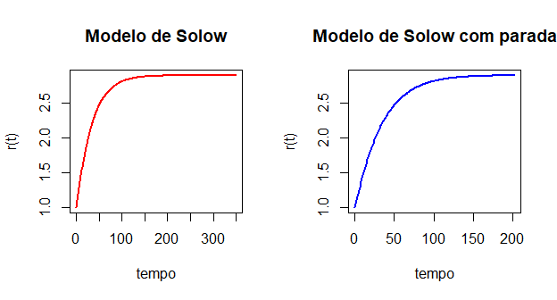

# EDOs de 2<sup>a</sup> ordem

EDOs de 2<sup>a</sup> ordem envolvem a segunda derivada da função
principal. Vale notar que, para fins computacionais, EDOs de
2<sup>a</sup> ordem precisam ser escritas sob a forma de um sistema de
equações de EDOs de 1<sup>a</sup> ordem[10], bem como duas condições
iniciais. Assim, uma EDO no formato pode ser reescrita como

A título de exemplo, pode-se simular o modelo de acelerador de segunda
ordem exposto em [Gandolfo](#ref-Gandolfo2005)
([2005](#ref-Gandolfo2005)). A EDO do modelo é em que *K* é o estoque
corrente de capital, *K*<sup>\*</sup> é o estoque desejado de capital,
*β* denota a velocidade de ajuste do investimento real ao investimento
desejado. Por fim, *α* é a velocidade de ajuste entre o estoque real e o
desejado.

É possível ampliar o sistema com *K*<sup>\*</sup> = *k**Y*, em que *k* é
a relação capital-produto e *Y* é o produto da economia. Assim, a
equação @ref(eq:acelerador1) pode ser reescrita, após manipulações
algébricas, como em que os termos *a* e *b* se referem a uma versão
macroeconômica simples de uma função de consumo no formato
*C* = *a* + *b**Y*.

A versão em sistema de EDOs de 1<sup>a</sup> ordem da equação
@ref(eq:acelerador2) pode ser feita considerando *I* = *K*′ o
investimento e isolando as derivadas no lado esquerdo das equações:

Diante disso, segue-se passos semelhantes à resolução de EDOs de
1<sup>a</sup> ordem. Em primeiro lugar, cria-se a função, agora com duas
equações e duas saídas de dados.

``` r
  ### EDO do Acelerador de 2a ordem
acel_edo <-     function(tempo, inicial, parametros){
      with(as.list(c(inicial, parametros)),{
        
        # Equações apresentadas em (9)
        dK <- I
        dI <- -beta*(1-(alfa*k/(1-b)))*I - alfa*beta*K + alfa*beta*k*a/(1-b)
        
        list(c(dK,dI))   # Retorna dois valores
      })
    }
```

Em seguida, definem-se os parâmetros e o gráfico para representá-los na
Figura @ref(fig:acelerador).

``` r
tempo <- seq(0,200, by = 0.5)

inicial <- c(K = 1, I = 0)

parametros <- c(alfa = 0.05,
                beta = 0.25,
                a = 2,
                b = 0.8,
                k = 3)

  ### Função semelhante à situação de 1a ordem
acel <- ode(y = inicial,
            times = tempo,
            func = acel_edo,
            parms = parametros)

  ### Gráfico da EDO
plot(x = acel[,"time"],
     y = acel[,"K"],
     type = "l",
     lwd = 2,
     col = "red",
     xlab = "tempo",
     ylab = "K(t)",
     main = TeX("Acelerador de 2^a ordem")) # Formato de texto LaTeX

abline(h = 30,           # Acrescenta linha tracejada para o equilíbrio
       lty = "dashed")   
```

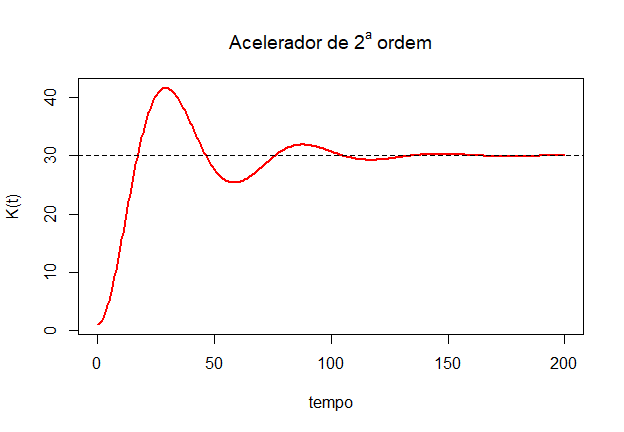

Por fim, note que as EDOs de ordem superiores podem ser resolvidas
adotando uma combinação dos procedimentos explicitados acima.

## Equação com coeficientes constantes

Equações com coeficientes constantes apresentam apenas a equação
principal e suas derivadas variáveis no tempo. Um exemplo é a função
*y*″(*t*) + 2*y*′(*t*) + *y*(*t*) = 0. Sua versão em sistema de EDOs de
1<sup>a</sup> ordem pode ser feita considerando
*y*<sub>1</sub>(*t*) = *y*(*t*)′, isolando as derivadas no lado esquerdo
das equações e adotando uma das soluções canônicas, conforme :

Diante disso, segue-se passos semelhantes à resolução de EDOs de
1<sup>a</sup> ordem. Em primeiro lugar, cria-se a função, agora com duas
equações e duas saídas de dados. O gráfico está representado na Figura
@ref(fig:constante).

``` r
  ### EDO de equação de coeficientes constantes
raizes_iguais <-  function(t, inicial, parametros){
  with(as.list(c(inicial, parametros)),{
    
  ### Sistema de Equações representando EDO de 2a ordem
    dy <- y1
    dy1 <- -2*y1 - y
    
  ### Resultados devem ser concatenados em uma lista
    list(c(dy,dy1))
  })
}

  ### Tempo máximo reduzido, pois converge rapidamente
tempo <- seq(1, 20, by = 0.1)


  ### Condições iniciais canônicas
inicial <- c(y = 0, y1 = 1)

  ### EDO
raizes_iguais_edo <- ode(y = inicial,
                         times = tempo,
                         func = raizes_iguais,
                         parms = NULL)        # Equação com parâmetros já definidos
```

``` r
  ### Gráfico da EDO com coeficientes constantes
plot(raizes_iguais_edo[,"time"], raizes_iguais_edo[,"y"],
     type = "l",
     lwd = 2,
     col = "red",
     xlab = "t",
     ylab = "y(t)",
     main = TeX("$y''(t) + 2y'(t) + y(t) = 0$")) # Formato de texto LaTeX
```

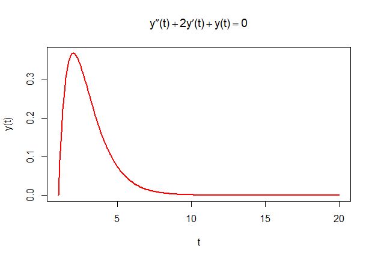

## Equação de Laguerre

A equação de Laguerre tem aplicabilidade na Física quântica e em outras
áreas da Matemática e Física. Exemplos de aplicações estão em . Um dos
exemplos está na versão do orbital *s* de um átomo de hidrogênio em seu
menor nível de energia. A equação de Laguerre, nesse caso, é dada por
*x**y*″(*x*) + (1 − *x*)*y*′(*x*) + *y*(*x*) = 0. Sua versão em sistema
de EDOs de 1<sup>a</sup> ordem pode ser feita considerando
*y*<sub>1</sub>(*x*) = *y*(*x*)′ e isolando as derivadas no lado
esquerdo das equações e adotando uma das soluções canônicas:

Diante disso, segue-se passos semelhantes à resolução de EDOs de
1<sup>a</sup> ordem. Em primeiro lugar, cria-se a função, agora com duas
equações e duas saídas de dados. O gráfico está representado na Figura
@ref(fig:laguerre).

``` r
  ### EDO de equação de Laguerre
laguerre <-  function(x, inicial, parametros){
  with(as.list(c(inicial, parametros)),{
    
    # Sistema de Equações representando EDO de 2a ordem
    
    dy <- y1
    dy1 <- -(1-x)/x*y1 - y/x
    
    # Resultados devem ser concatenados em uma lista
    
    list(c(dy,dy1))
  })
}

x <- seq(1, 50, by = 0.1)


  ### Condições iniciais canônicas
inicial <- c(y = 0, y1 = 1)

    
  ### EDO
laguerre_edo <- ode(y = inicial,
                     times = x,
                     func = laguerre,
                     parms = NULL)
```

``` r
  ### Gráfico da EDO de Laguerre
plot(laguerre_edo[,"time"], laguerre_edo[,"y"],
     type = "l",
     lwd = 2,
     col = "green",
     xlab = "x",
     ylab = "y(x)",
     main = TeX("$xy''(x) + (1-x)y'(x) + y(x) = 0$")) # Formato de texto LaTeX
```

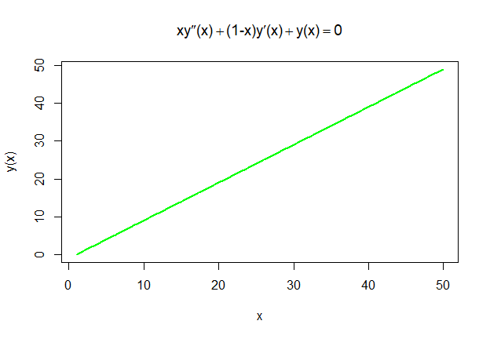

## Equação de Euler

Um exemplo da chamada \`\`equação de Euler" é dado pela função
*t*<sup>2</sup>*y*″(*t*) + 2*t**y*′(*t*) − 2*y*(*t*) = *t*<sup>5</sup>,
conforme . Sua versão em sistema de EDOs de 1<sup>a</sup> ordem pode ser
feita considerando *y*<sub>1</sub>(*t*) = *y*(*t*)′ e isolando as
derivadas no lado esquerdo das equações e adotando uma das soluções
canônicas, conforme:

Diante disso, segue-se passos semelhantes à resolução de EDOs de
1<sup>a</sup> ordem. Em primeiro lugar, cria-se a função, agora com duas
equações e duas saídas de dados. O gráfico está representado na Figura
@ref(fig:euler).

``` r
  ### EDO de equação de Euler
euler <-  function(t, inicial, parametros){
  with(as.list(c(inicial, parametros)),{
    
    # Sistema de Equações representando EDO de 2a ordem
    
    dy <- y1
    dy1 <- -2/t*y1 + 2*y/t**2 + t**3
    
    # Resultados devem ser concatenados em uma lista
    
    list(c(dy,dy1))
  })
}

tempo <- seq(1,10, by = 0.2)

  ### Condições iniciais canônicas
inicial <- c(y = 1, y1 = 0)

  ### EDO
euler_edo <- ode(y = inicial,
                 times = tempo,
                 func = euler,
                 parms = NULL)
```

``` r
  ### Gráfico da EDO com coeficientes constantes
plot(euler_edo[,"time"],euler_edo[,"y"],
     type = "l",
     lwd = 2,
     col = "blue",
     xlab = "t",
     ylab = "y(t)",
     main = TeX("$t^2y''(t) + 2ty'(t) - 2y(t) = t^5$ ")) # Formato de texto LaTeX
```

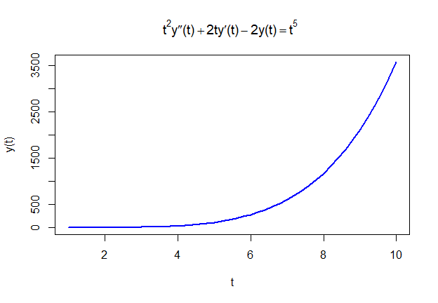

# Equações diferenciais simultâneas

O caso de um sistema com duas EDOs de 1<sup>a</sup> ordem pode ser
resolvido de maneira semelhante ao modelo de 2<sup>a</sup> ordem
apresentado na seção @ref(edo2). Portanto, aqui será apresentada uma
solução numérica para um sistema de três EDOs simultâneas trabalhado por
[Ma and Bangura](#ref-Ma2012) ([2012](#ref-Ma2012)). Trata-se de um
sistema econômico e financeiro que combina taxa de juro, de investimento
e de inflação. Os detalhes do modelo devem ser avaliados no artigo
original.

O sistema fincaneiro (caótico) representado no modelo é tal que: em que
*x* expressa a taxa de juro, *y* representa a demanda por investimento e
*z*, o índice de preços. Ademais, *a* ≥ 0 é o volume de poupança,
*b* ≥ 0 é o custo unitário do investimento e *c* ≥ 0 é a elasticidade da
demanda por bens.

Para a simulação numérica, usam-se os seguintes valores iniciais e
parâmetros sugeridos pelos autores: *x*<sub>0</sub> = 0.03,
*y*<sub>0</sub> = 0.15, *z*<sub>0</sub> = 0.25, *a* = 5, *b* = 0.15 e
*c* = 0. Com isso, a função é formada por:

``` r
  ### EDO do sistema financeiro caótico
financial_edo <- function(tempo, inicial, parametros) {
  with(as.list(c(inicial,parametros)),{
    dx <- z+(y - a)*x
    dy <- 1 - b*y - x^2
    dz <- -x - c*z
    
    list(c(dx,dy,dz))
  })
}
```

O modelo pode com as três variáveis ser simulado na Figura
@ref(fig:financial) por meio do pacote **scatterplot3d**.

``` r
tempo <- seq(0,100,by = .01)

inicial <- c(x = .03,
             y = .15,
             z = .25)

parametros <- c(a = 5,
                b = .15,
                c = .8)

  ### EDO    
financial <-  ode(y = inicial,
                  times = tempo,
                  func = financial_edo,
                  parms = parametros)

  ### Gráfico 3D de todo o sistema
scatterplot3d(financial[,-1],    # Exclui a coluna tempo para que apenas 
              type = "l",        # as variáveis sejam representadas
              lwd = 3,
              xlab = "juro",
              ylab = "investimento",
              zlab = "preços")
```

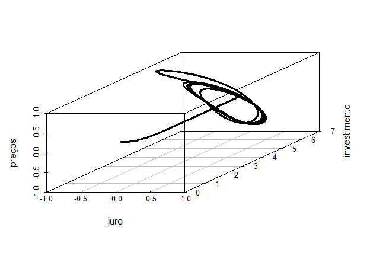

A partir da resolução de todo o sistema, pode-se avaliar apenas a
relação entre duas variáveis como na Figura @ref(fig:juro):

``` r
  ### Relação entre juro e demanda por investimento
plot(x = financial[,"x"],
     y = financial[,"y"],
     type = "l",
     lwd = 3,
     xlab = "juro",
     ylab = "investimento")
```

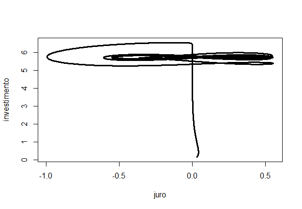

A relação entre inflação e juro está na Figura @ref(fig:inflacaojuro).

``` r
  # Relação entre juro e preço
matplot(x = financial[,"time"],
        y = financial[,c("x","z")],
        type = "l",
        lwd = 3,
        xlab = "tempo",
        ylab = "")           # Exclui o título do eixo y

  ### Legenda
legend("bottomleft",         # Local no gráfico
       c("juro", "preços"),  # Conteúdo da Legenda
       col = 1:2,            # Cores preto (1) e vermelho (2)
       lty = 1:2)            # Linha contínua (1) e tracejada (2)
```

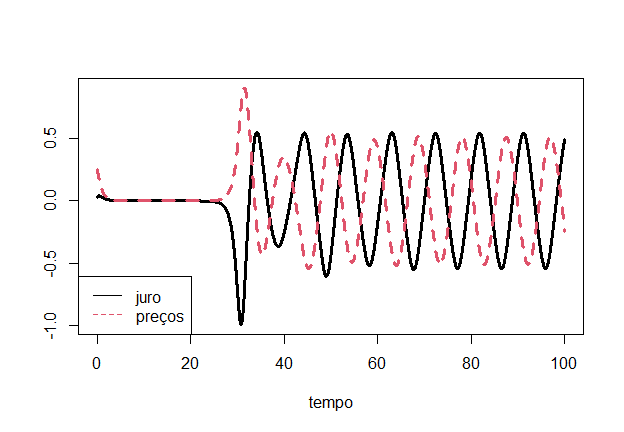

# Análise de estabilidade

A análise de estabilidade com o pacote **phaseR** apresenta, de maneira
gráfica, um diagrama de fase de uma EDO ou sistema de EDOs de modo a
avaliar trajetórias iniciais distintas ou consequências de perturbações
no modelo dinâmico.

Este pacote depende de uma função que represente a EDO a partir da
estrutura **deSolve**, vista nas seções anteriores. Os nomes dos
parâmetros até agora foram adotados para que ficassem mais intuitivos.
Entretanto, para o retrato de fase, os nomes dos parâmetros que aparecem
na função da EDO devem ser os mesmos aceitos pelo próprio pacote
**deSolve** conforme:

1.  O tempo deve ser representado pela letra **t**;
2.  Os valores iniciais devem estar contidos num vetor **y**; e
3.  Os parâmetros, indicados em um vetor **parameters**.

## Estabilidade de EDO de 1<sup>a</sup> ordem

Como primeiro exemplo, tem-se a análise do modelo de Solow, apresentado
na seção @ref(solow). Reorganizando os nomes da função e dos parâmetros,
os comandos são:

``` r
  ### EDO com os nomes padrão dos parâmetros
solow_edo <- function(t,y,parameters){
  with(as.list(c(y,parameters)),{
    
    r = y                # Adaptação da notação do modelo
    
    dr = s*r^alpha - n*r
    
    list(dr)
  })
}

t <- seq(0,300,1)
y <- c(r = 1)
parameters <- c(s= 0.1, alpha = 0.35, n=0.05)
```

Após os ajustes na nomenclatura, é possível acrescentar o campo de
fluxos (ou de velocidades) com a função *flowField*(). Ademais, pode-se
simular algumas trajetórias com a função *trajectory*() a partir de
pontos iniciais distintos conforme a Figura @ref(fig:fase). O gráfico
base deve conter o ajuste “*add = FALSE*.” Caso contrário, será
adicionado a outro gráfico pré-existente, gerando problemas de
configuração.

``` r
  ### Gráfico com o campo de fluxos
flowField(solow_edo,                # EDO
          xlim   = c(0,300),        # Limite para o eixo do tempo
          ylim   = c(0,4.1),        # Limite para a variável em análise
          system = "one.dim",       # Apenas uma variável contra o tempo
          parameters = parameters,  # Vetor numérico
          add = FALSE,              # Se TRUE, adiciona campo a um gráfico anterior
          points = 15,              # Densidade de setas (default = 21)
          xlab = "tempo",
          ylab = "r(t)",
          main = "Estabilidade do Modelo de Solow")


  ### Desenho das trajetórias a partir de  condições iniciais
trajectory(solow_edo,
           y0     = c(0, 0.5, 1.5, 2.5, 3, 3.5, 4), # diferentes pontos iniciais
           tlim   = c(0, 300),
           system = "one.dim",
           parameters = parameters,
           col = "blue")
```

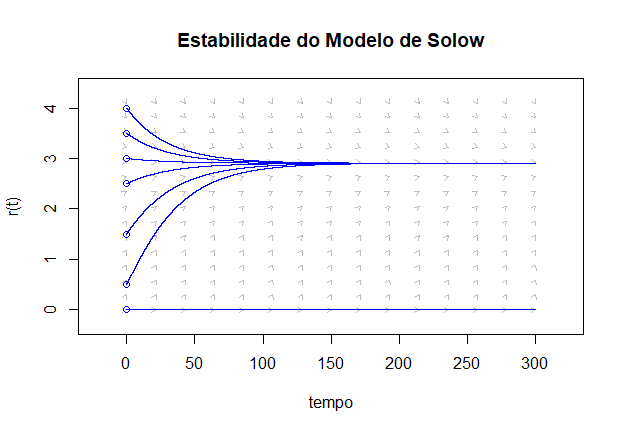

### Retrato de fase

Pode-se também fazer o retrado de fase como na Figura @ref(fig:retrato),
em que a variável em nível está representada no eixo horizontal e sua
derivada no eixo vertical. Com isso, visualiza-se pontos de equilíbrio e
suas estabilidades.

``` r
  ### Retrato de fase
phasePortrait(solow_edo,
              ylim   = c(0, 4),        # Limite da variável dependente
              system = "one.dim",
              parameters = parameters,
              col = "red",
              xlab = "r(t)",
              ylab = TeX("\\dot{r}(t)"),
              main = "Retrato de Fase do Modelo de Solow")
```

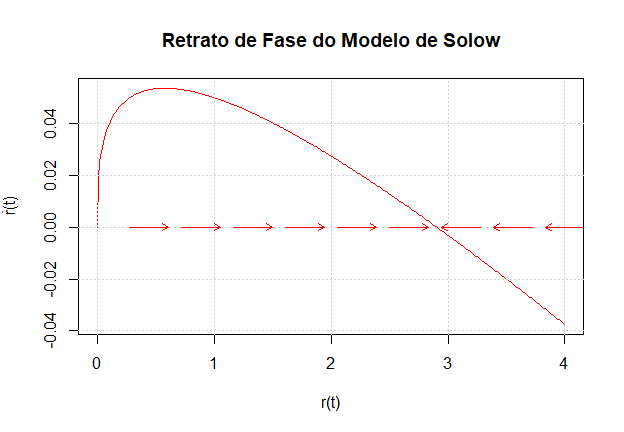

## Estabilidade de sistema de duas EDOs de 1<sup>a</sup> ordem - equilíbrio dinâmico

Procedimentos semelhantes podem ser adotados para um sistema com duas
equações. Para um exemplo de sistema homogêneo de EDOs cujo equilíbrio é
estável, utiliza-se exemplo sugerido por [Gandolfo](#ref-Gandolfo2005)
([2005](#ref-Gandolfo2005)) no capítulo 18 (exercício 3), cuja esturutra
é: Além das informações disponíveis para o caso de uma variável
(dimensão) apresentado acima, é possível desenhar as isolinhas nulas,
que representam o formato geométrico onde a derivada de uma função é
zero. Elas podem ser elaboradas com a função *nullclines*(). Note que,
agora, os valores iniciais para a trajetória devem ser oferecidos em
formato de matriz, representando os pares ordenados. O resultado pode
ser visto na Figura @ref(fig:estavel).

``` r
    ### EDO do sistema
gandolfo_edo_estavel <- function(t,y,parameters){
  x <- y[1]      # Valores iniciais em formato de vetor
  y <- y[2]      # e precisam ser renomeados
  
  dx <- -x-y
  dy <- 5*x-3*y 
  
  list(c(dx,dy))
}

  ### Gráfico com o campo de fluxos
flowField(gandolfo_edo_estavel,
          xlim   = c(-5,5),     # Limite da primeira variável
          ylim   = c(-5,5),     # Limite da primeira variável
          add = FALSE,
          points = 15)

  ### Isolhinhas nulas
nullclines(gandolfo_edo_estavel, # EDO
           xlim   = c(-5,5),     # Limites compatíveis com o campo de fluxos
           ylim   = c(-5,5))

  ### Matriz com as condições iniciais
y0 <- matrix(c(0,3,         # Pares ordenaos para y0
               0,-3,
               -5,0,
               4,-1),
             ncol = 2,
             byrow = TRUE) # Insere os dados numa matriz a partir das linhas

  ### Desenho das trajetórias a partir de  condições iniciais
trajectory(gandolfo_edo_estavel,
           y0   = y0,
           tlim = c(-5, 5))
```

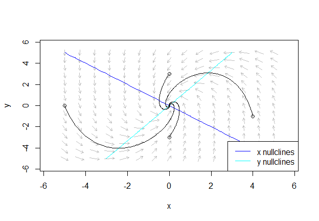

``` r
  ### Matriz com as condições iniciais
y0
```

    ##      [,1] [,2]
    ## [1,]    0    3
    ## [2,]    0   -3
    ## [3,]   -5    0
    ## [4,]    4   -1

## Estabilidade de sistema de duas EDOs de 1<sup>a</sup> ordem - ponto de sela

Para um exemplo de sistema de EDOs cujo equilíbrio é caracterizado por
uma trajetória de sela, pode-se adotar o sistema homogêneo sugerido por
[Gandolfo](#ref-Gandolfo2005) ([2005](#ref-Gandolfo2005)) no capítulo 18
( exercício 1) cuja esturutra é: É possível perceber que se trata de uma
trajetória de sela, cujas trajetórias estáveis e instáveis podem ser
elaboradas com a função *drawManifolds*(). O resultado pode ser visto na
Figura @ref(fig:sela).

``` r
  ### EDO
gandolfo_edo <- function(t,y,parameters){
  
  x <- y[1]      # Valores iniciais em formato de vetor
  y <- y[2]      # e precisam ser renomeados
  
  dx <- -2*x-4*y
  dy <- -x+y 
  
  list(c(dx,dy))
}

  ### Campo de fluxos
flowField(gandolfo_edo,
          xlim   = c(-5,5),
          ylim   = c(-5,5),
          add = FALSE,
          points = 15)

  ### Isolinhas
nullclines(gandolfo_edo,
           xlim   = c(-5,5),
           ylim   = c(-5,5))

  ### Trajetórias de sela (instável e estável)
drawManifolds(gandolfo_edo,
              y0 = c(0, 0))

  ### Matriz de choques iniciais
y0 <- matrix(c(0,3,
               0,-3,
               -5,0,
               4,-1),
             ncol = 2,
             byrow = TRUE)

  ### Trajetórias de choques
trajectory(gandolfo_edo,
           y0   = y0,
           tlim = c(-5, 5))
```

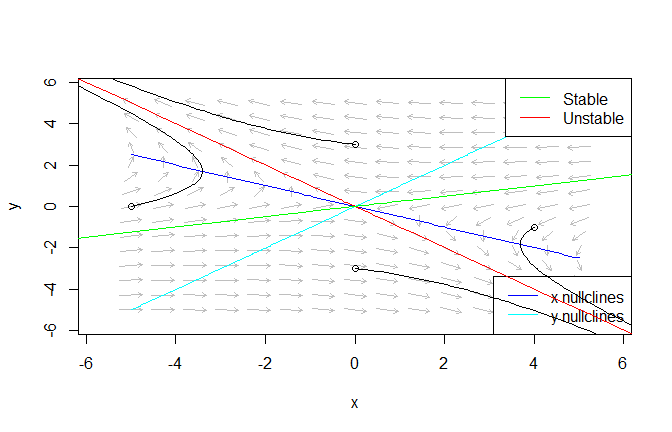

Em linhas gerais, essas são as informações mais comuns na análise de
sistemas dinâmicos no campo da Economia. Funções e tratamentos
adicionais podem ser avaliados nos itens referenciados abaixo.

# Referências

<div id="refs" class="references csl-bib-body hanging-indent">

<div id="ref-Gandolfo2005" class="csl-entry">

Gandolfo, Giancarlo. 2005. *Economic Dynamics*. Study. New York - USA:
Springer US.

</div>

<div id="ref-Ma2012" class="csl-entry">

Ma, Junhai, and Hamza I. Bangura. 2012. “<span class="nocase">Complexity
analysis research of financial and economic system under the condition
of three parameters’ change circumstances</span>.” *Nonlinear Dynamics*
70 (4): 2313–26. <https://doi.org/10.1007/s11071-012-0336-z>.

</div>

<div id="ref-Seco2018" class="csl-entry">

Seco, Lucas, and Mauro Patrão. 2018. *<span class="nocase">Equa<span
class="nocase">ç</span><span class="nocase">õ</span>es diferenciais
ordin<span class="nocase">á</span>rias e s<span
class="nocase">é</span>ries de pot<span
class="nocase">ê</span>ncias</span>*. Brasília - BRA: Editora
Universidade de Brasília.

</div>

<div id="ref-Soetaert2012" class="csl-entry">

Soetaert, Karline, Jeff Cash, and Francesca Mazzia. 2012. *<span
class="nocase">Use R ! Solving Differential Equations in
R-Springer</span>*. Verlag Berlin Heidelberg: Springer.

</div>

<div id="ref-Soetaert2010" class="csl-entry">

Soetaert, Karline, Thomas Petzoldt, and R. Woodrow Setzer. 2010. “<span
class="nocase">Solving differential equations in R: Package
deSolve</span>.” *Journal of Statistical Software* 33 (9): 1–25.
<https://doi.org/10.18637/jss.v033.i09>.

</div>

<div id="ref-Solow1956" class="csl-entry">

Solow, Robert M. 1956. “<span class="nocase">A Contribution to the
Theory of Economic Growth</span>.” *The Quaterly Journal of Economics*
70 (1): 65–95. <http://piketty.pse.ens.fr/files/Solow1956.pdf>.

</div>

</div>

[1] Doutorando em Economia pela Universidade de Brasília. Pode ser
contatado em <rafaeldeacyprestemr@gmail.com>.

[2] Doutor em Economia pela Universidade de Brasília. Pode ser contatado
em <theosantunes@gmail.com>.

[3] Graduanda em Economia pela Universidade de Brasília. Pode ser
contatada em <izabelflores9@gmail.com>.

[4]  Alguns exemplos de representação gráfica podem ser vistos com a
função *example(deSolve)*.

[5]  Para ver exemplos da função, clique
[aqui](https://statisticsglobe.com/r-with-within-function-example#:~:text=Definition%20of%20with%20%26%20within%3A,AND%20modifies%20the%20original%20data.).

[6] O tempo demandado para a análise pode ser medido com as seguintes
funções concatenadas: **print(system.time(&lt;código da função
ode&gt;))**.

[7] Os detalhes do modelo podem ser consultados, pelo leitor, no artigo
original e os artigos que o discutiram posteriormente.

[8] Esta é a operação padrão na própria função **ode()**.

[9] Esta função desenha mais de uma coluna de uma matriz ao mesmo tempo.
Com a função **plot()**, seriam necessários dois comandos.

[10] Para mais detalhes, ver [Soetaert, Cash, and
Mazzia](#ref-Soetaert2012) ([2012](#ref-Soetaert2012)).
